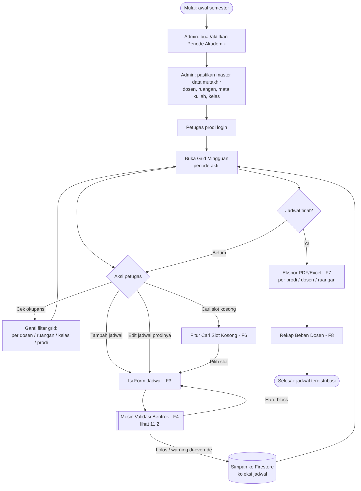
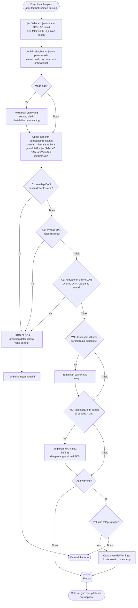
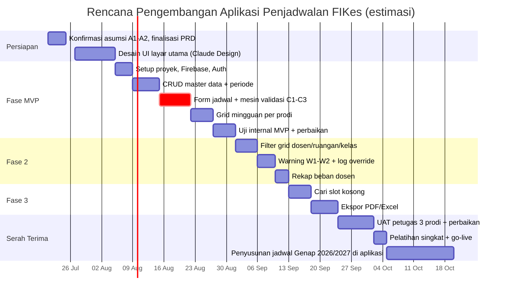

# PRD — Sistem Penjadwalan Mata Kuliah FIKes UIS

**Versi:** 1.1 — 21 Juli 2026 (penambahan flowchart & gantt chart)
**Pemilik produk:** Roni Saputra, M.Si.
**Status:** Draf untuk pengembangan (Claude Design → frontend, Claude Code → implementasi)

---

## 1. Latar Belakang & Tujuan

Penjadwalan mata kuliah di Fakultas Ilmu Kesehatan (FIKes) Universitas Ibnu Sina saat ini disusun manual per prodi, sehingga bentrok antar jadwal (dosen mengajar di dua tempat sekaligus, ruangan dipakai ganda, satu rombel mendapat dua mata kuliah bersamaan) baru ketahuan setelah jadwal berjalan. Karena dosen dan ruangan adalah sumber daya bersama lintas prodi, bentrok paling sering terjadi justru **antar prodi**, bukan di dalam satu prodi.

**Tujuan produk:** aplikasi web tempat petugas penjadwalan tiga prodi (S1 K3, S1 Kesehatan Lingkungan, S2 Kesehatan Masyarakat) menyusun jadwal secara **manual** dengan **validasi bentrok real-time lintas prodi** sebelum jadwal disimpan.

**Ukuran keberhasilan:**
- Nol bentrok dosen/ruangan/kelas pada jadwal yang dipublikasikan.
- Petugas satu prodi dapat melihat okupansi dosen dan ruangan dari prodi lain saat menyusun jadwal.
- Jadwal final dapat diekspor per prodi, per dosen, dan per ruangan.

## 2. Pengguna & Peran

| Peran | Hak akses |
|---|---|
| **Petugas Prodi** | Membuat/mengubah/menghapus jadwal untuk prodinya sendiri. Melihat (read-only) jadwal seluruh prodi. Melihat semua master data. |
| **Admin Fakultas** | Semua hak Petugas Prodi untuk seluruh prodi + kelola master data (prodi, dosen, ruangan, mata kuliah, kelas, periode) + kelola akun pengguna. |

Prinsip penting: **visibilitas lintas prodi terbuka untuk semua pengguna.** Pembatasan hanya pada hak tulis, bukan hak baca — karena tujuan utama aplikasi adalah mendeteksi konflik pada sumber daya bersama.

Autentikasi: Firebase Authentication (email/password). Peran dan prodi pengguna disimpan di koleksi `users`.

## 3. Lingkup

### Termasuk (in scope)
1. CRUD master data: prodi, dosen, ruangan, mata kuliah, kelas/rombel, periode akademik.
2. Input jadwal manual dengan validasi bentrok real-time.
3. Deteksi bentrok tiga sumbu: **dosen, ruangan, kelas** — lintas prodi.
4. Dukungan mode kuliah **offline** (wajib pilih ruangan) dan **online** (tanpa ruangan; bentrok ruangan tidak berlaku, bentrok dosen dan kelas tetap berlaku).
5. Durasi otomatis dari SKS (1 SKS = 50 menit).
6. Team teaching (lebih dari satu dosen per entri jadwal; SKS dibagi rata antar dosen).
7. Warning (non-blocking): dosen >3 sesi berturut-turut per hari; total beban dosen >16 SKS per periode.
8. Tampilan grid mingguan dengan filter per prodi / dosen / ruangan / kelas.
9. Fitur "cari slot kosong" untuk kombinasi dosen + kelas + durasi.
10. Ekspor PDF/Excel per prodi, per dosen, per ruangan.
11. Log override warning (siapa menyimpan entri meski ada warning).

### Tidak termasuk (out of scope) — keputusan eksplisit pemilik produk
- Auto-generate jadwal (auto-scheduler / optimasi otomatis).
- Validasi kapasitas ruangan vs jumlah mahasiswa.
- Jenis/kategori ruangan (lab vs kelas biasa).
- Data ketersediaan/preferensi hari dosen.
- Jeda ibadah / blokir waktu tertentu.
- Portal mahasiswa atau dosen (aplikasi ini khusus petugas penjadwalan).
- KRS, presensi, atau integrasi SIAKAD.

## 4. Asumsi & Keputusan Terbuka

| # | Asumsi | Konsekuensi jika salah |
|---|---|---|
| A1 | Ruangan adalah **pool bersama** seluruh FIKes; bentrok ruangan dicek lintas prodi. | Jika tiap prodi punya alokasi ruangan sendiri, tambahkan field `prodiId` opsional di `ruangan` dan batasi pilihan ruangan di form. Logika bentrok tidak berubah. |
| A2 | Jam mulai kuliah **bebas** (time picker), bukan sesi tetap kampus. Jam selesai dihitung otomatis dari SKS. | Jika kampus punya standar sesi, ganti time picker dengan dropdown sesi; simpan tetap sebagai jamMulai/jamSelesai sehingga logika bentrok tidak berubah. |
| A3 | Batas 16 SKS dihitung per periode akademik, akumulasi lintas prodi. | — |
| A4 | Hari perkuliahan Senin–Sabtu. | Mudah diubah lewat konstanta konfigurasi. |

Implementasi harus menempatkan A1–A4 sebagai konfigurasi/konstanta yang mudah diubah, bukan hard-code tersebar.

## 5. Kebutuhan Fungsional

### F1 — Manajemen Periode Akademik
- Admin membuat periode (contoh: "Ganjil 2026/2027") dengan status aktif/nonaktif.
- Hanya satu periode aktif pada satu waktu; semua input jadwal dan validasi bentrok berlaku dalam lingkup periode aktif.
- Jadwal periode lama tetap dapat dilihat (read-only) dan diekspor.

### F2 — Master Data
CRUD standar dengan soft-delete (flag `aktif`) agar data historis jadwal tidak rusak:
- **Prodi:** kode, nama, jenjang (S1/S2).
- **Dosen:** NIDN/NIDK, nama lengkap + gelar. *Global — satu koleksi untuk seluruh fakultas, bukan per prodi.* Ini prasyarat deteksi bentrok dan akumulasi SKS lintas prodi.
- **Ruangan:** kode, nama, gedung/lantai.
- **Mata kuliah:** kode, nama, SKS, semester ke-, prodi pemilik, status aktif.
- **Kelas/rombel:** prodi, angkatan, nama rombel (contoh: "K3-2024-A"), semester berjalan.
- **Pengguna:** email, nama, peran (petugas/admin), prodi (untuk petugas).

### F3 — Input & Edit Jadwal
Form dengan urutan field:
1. Mata kuliah (dropdown, difilter prodi petugas; menampilkan SKS).
2. Kelas/rombel (difilter prodi + semester yang sesuai mata kuliah).
3. Dosen (multi-select untuk team teaching; pencarian nama; lintas prodi).
4. Mode: offline / online.
5. Ruangan (dropdown; hanya tampil dan wajib jika mode offline).
6. Hari (Senin–Sabtu).
7. Jam mulai (time picker). **Jam selesai dihitung otomatis** = jam mulai + (SKS × 50 menit), ditampilkan read-only.

Perilaku validasi:
- Validasi berjalan **saat field terisi lengkap, sebelum tombol simpan ditekan** (live), dan diulang saat submit.
- Hasil validasi tampil inline di form: daftar konflik dengan detail lengkap ("Bentrok dosen: Dr. X sudah mengajar Epidemiologi (Kesmas-2025-A) Senin 08.00–10.30, Ruang B203").
- **Hard block** (tombol simpan nonaktif) untuk bentrok dosen/ruangan/kelas.
- **Warning kuning** (boleh simpan) untuk aturan beban dosen; jika petugas tetap menyimpan, sistem mencatat override (userId + timestamp + warning yang diabaikan) di dokumen jadwal.
- Edit entri: validasi harus **mengecualikan entri itu sendiri** dari pengecekan bentrok.

### F4 — Mesin Validasi Bentrok
Definisi overlap dua entri (A = entri yang divalidasi, B = entri tersimpan di periode aktif):

```
overlap(A, B) = A.hari == B.hari
             && A.jamMulai < B.jamSelesai
             && B.jamMulai < A.jamSelesai
```

Aturan (dicek terhadap **seluruh jadwal periode aktif, semua prodi**):

| Kode | Aturan | Jenis | Kondisi |
|---|---|---|---|
| C1 | Bentrok dosen | Hard block | overlap && irisan `dosenIds` tidak kosong. Berlaku juga untuk sesi online. |
| C2 | Bentrok kelas | Hard block | overlap && `kelasId` sama. Berlaku juga untuk sesi online. |
| C3 | Bentrok ruangan | Hard block | overlap && kedua entri offline && `ruanganId` sama. |
| W1 | Sesi berturut-turut | Warning | Penyimpanan entri ini membuat salah satu dosen memiliki >3 sesi yang saling bersambung/beririsan dalam satu hari. |
| W2 | Beban SKS | Warning | Total `sksEfektifPerDosen` dosen tersebut di periode aktif (termasuk entri ini) > 16. Tampilkan angka aktual, mis. "menjadi 17,5 SKS". |

Catatan implementasi W2: `sksEfektifPerDosen = SKS mata kuliah ÷ jumlah dosen`, disimpan sebagai desimal (jangan dibulatkan; 3 SKS ÷ 2 dosen = 1,5). Akumulasi dihitung per mata-kuliah-per-kelas unik, bukan per pertemuan.

Strategi teknis: karena volume data kecil (perkiraan ratusan entri per periode), muat seluruh jadwal periode aktif ke client (subscription Firestore `onSnapshot` pada `jadwal` where `periodeId == aktif`) dan lakukan seluruh pengecekan di client. Jangan mencoba query range-overlap di Firestore — tidak didukung native. Validasi diulang saat submit dengan data snapshot terbaru untuk mengurangi race condition antar petugas.

### F5 — Tampilan Grid Mingguan (layar utama)
- Grid: kolom = hari (Senin–Sabtu), baris = sumbu waktu (07.00–21.00, granularity 30 menit untuk rendering; posisi blok mengikuti menit sebenarnya).
- Setiap entri tampil sebagai blok berwarna berdasarkan prodi (3 warna konsisten), berisi: kode MK, rombel, dosen (singkat), ruangan/ONLINE.
- **Filter mode tampilan** (satu aktif pada satu waktu): per Prodi (default: prodi pengguna), per Dosen, per Ruangan, per Kelas. Mode per-Dosen dan per-Ruangan adalah alat utama melihat okupansi lintas prodi.
- Klik blok → panel detail dengan tombol Edit/Hapus (jika berhak) .
- Tombol "+ Jadwal" membuka form F3; opsional: klik area kosong grid untuk pre-fill hari & jam.

### F6 — Cari Slot Kosong
- Input: dosen (satu atau lebih), kelas, durasi (otomatis dari SKS mata kuliah yang dipilih), mode + ruangan opsional.
- Output: daftar semua rentang waktu per hari yang lolos C1–C3 untuk kombinasi tersebut, jam operasional 07.00–21.00.
- Klik hasil → buka form input dengan field ter-pre-fill.

### F7 — Ekspor
- PDF dan Excel (xlsx), masing-masing untuk: jadwal per prodi (tabel per hari), jadwal per dosen (termasuk rekap total SKS), jadwal per ruangan.
- Header dokumen: identitas fakultas, periode, tanggal cetak.

### F8 — Rekap Beban Dosen
- Tabel seluruh dosen di periode aktif: nama, jumlah entri, total SKS efektif, badge merah jika >16 SKS.
- Berguna sebagai laporan beban mengajar fakultas.

## 6. Model Data (Firestore)

```
users/{uid}
  email, nama, peran: "petugas"|"admin", prodiId (null utk admin), aktif

prodi/{id}
  kode, nama, jenjang

dosen/{id}
  nidn, nama, aktif

ruangan/{id}
  kode, nama, gedung, aktif

mataKuliah/{id}
  kode, nama, sks: number, semesterKe, prodiId, aktif

kelas/{id}
  prodiId, angkatan, namaRombel, semesterKe, aktif

periode/{id}
  nama, aktif: boolean, tanggalMulai, tanggalSelesai

jadwal/{id}
  periodeId, mataKuliahId, kelasId
  dosenIds: string[]              // >=1; team teaching jika >1
  mode: "offline"|"online"
  ruanganId: string|null          // wajib jika offline, null jika online
  hari: 1..6                      // Senin=1 .. Sabtu=6
  jamMulai: number                // menit sejak 00.00, mis. 480 = 08.00
  jamSelesai: number              // dihitung: jamMulai + sks*50
  sksEfektifPerDosen: number      // sks / dosenIds.length, desimal
  prodiId                         // denormalisasi dari mataKuliah, utk filter & rules
  overrideWarnings: [{kode, userId, timestamp}] // kosong jika tanpa warning
  dibuatOleh, dibuatPada, diubahOleh, diubahPada
```

Rekomendasi: simpan jam sebagai **menit integer** (bukan string "08:00") — perbandingan overlap jadi aritmetika sederhana dan bebas bug parsing.

**Firestore Security Rules (garis besar):**
- Semua koleksi: read untuk pengguna terautentikasi & aktif.
- `jadwal`: create/update/delete hanya jika `request.auth` adalah admin, atau petugas dengan `prodiId` == `prodiId` entri.
- Master data & `users` & `periode`: write hanya admin.
- Catatan: validasi bentrok berjalan di client; security rules menjaga otorisasi, bukan konsistensi bentrok. Risiko sisa (dua petugas menyimpan bersamaan) diterima untuk v1 dan dimitigasi validasi ulang saat submit + re-check via onSnapshot.

## 7. Kebutuhan Non-Fungsional

- **Stack:** Next.js 14 (App Router), Firebase (Auth + Firestore), deploy Vercel — konsisten dengan aplikasi FIKes lain (SIBAU, SIM PBL, dll.).
- **Lingkungan pengembangan:** pemilik produk bekerja tanpa terminal lokal; seluruh alur build/deploy harus bisa lewat GitHub + Vercel + Claude Code. Hindari dependensi yang butuh proses build native rumit.
- **Bahasa antarmuka:** Bahasa Indonesia.
- **Responsif:** desktop-first (petugas bekerja di laptop); grid mingguan minimal usable di tablet. Mobile cukup read-only yang layak.
- **Performa:** seluruh jadwal satu periode dimuat sekali dan disubscribe; validasi bentrok harus terasa instan (<100 ms, komputasi lokal).
- **Ekspor:** gunakan pustaka client-side atau serverless-friendly (mis. exceljs untuk xlsx; @react-pdf/renderer atau jsPDF untuk PDF).

## 8. Struktur Layar (untuk Claude Design)

1. **Login** — email/password, logo fakultas.
2. **Dashboard/Grid Mingguan** (layar utama) — grid F5 + bar filter (mode tampilan, pemilih dosen/ruangan/kelas/prodi) + tombol "+ Jadwal" + indikator periode aktif.
3. **Form Jadwal** (modal atau halaman) — field F3 + panel hasil validasi live (daftar konflik merah / warning kuning) + tombol simpan yang menonaktifkan diri saat hard block.
4. **Cari Slot Kosong** — form ringkas + daftar hasil per hari.
5. **Rekap Beban Dosen** — tabel F8.
6. **Master Data** (admin) — tab per entitas, tabel + form CRUD standar.
7. **Ekspor** — pilihan jenis ekspor + format.
8. **Manajemen Pengguna & Periode** (admin).

Arah visual: bersih dan fungsional (ini alat kerja administratif, bukan landing page); warna pembeda tiga prodi dipakai konsisten di grid, badge, dan legenda; kondisi konflik selalu merah dengan pesan spesifik, warning selalu kuning.

## 9. Fase Pengembangan yang Disarankan

| Fase | Isi | Kriteria selesai |
|---|---|---|
| **MVP** | Auth + master data + F3/F4 (input & validasi bentrok C1–C3) + grid per-prodi | Petugas bisa menyusun jadwal satu periode tanpa bentrok tersimpan |
| **Fase 2** | Filter grid per dosen/ruangan/kelas + warning W1/W2 + rekap beban dosen + log override | Okupansi lintas prodi terlihat; beban dosen terpantau |
| **Fase 3** | Cari slot kosong + ekspor PDF/Excel | Jadwal final bisa didistribusikan |

## 10. Kriteria Penerimaan (contoh uji kunci)

1. Dosen X dijadwalkan Senin 08.00–10.30 di prodi K3. Petugas Kesmas mencoba menjadwalkan dosen X Senin 09.00 → **ditolak** dengan pesan menyebut jadwal K3 yang bentrok.
2. Sesi online dosen X Senin 08.00–09.40; entri offline dosen lain di ruangan mana pun pada jam sama → **boleh**; entri lain dosen X jam sama → **ditolak**.
3. MK 3 SKS, jam mulai 08.00 → jam selesai otomatis 10.30; tidak bisa diedit manual.
4. MK 3 SKS diampu 2 dosen → masing-masing tercatat 1,5 SKS di rekap.
5. Dosen dengan total 15 SKS ditambah MK 2 SKS → warning "menjadi 17 SKS", entri tetap bisa disimpan, override tercatat.
6. Edit entri tanpa mengubah waktu → tidak memicu bentrok dengan dirinya sendiri.
7. Petugas K3 tidak dapat mengubah entri milik Kesling (tombol edit tersembunyi **dan** ditolak security rules).

## 11. Flowchart

Diagram ditulis dalam sintaks Mermaid — dapat dirender langsung di GitHub/VS Code dan terbaca sebagai spesifikasi oleh Claude Code.

### 11.1 Alur proses penjadwalan (end-to-end)



### 11.2 Alur mesin validasi bentrok (F4)



## 12. Gantt Chart Rencana Pengembangan

Estimasi disusun mengikuti fase Bagian 9, mulai 21 Juli 2026, dengan target aplikasi siap dipakai untuk penyusunan jadwal semester Genap 2026/2027. Durasi adalah perkiraan kerja paruh waktu (pemilik produk mengembangkan di sela tugas lain dengan Claude Code); sesuaikan dengan ketersediaan waktu aktual.



Jalur kritis (ditandai `crit`) adalah **form jadwal + mesin validasi** — komponen ini menentukan nilai seluruh aplikasi; jika mundur, semua fase berikutnya mundur. Grid dan ekspor bisa dikompres bila waktu sempit; mesin validasi tidak.

---

*Dokumen ini siap dipakai sebagai konteks awal untuk Claude Design (fokus Bagian 5, 8, 11.1) dan Claude Code (fokus Bagian 4, 6, 7, 9, 10, 11.2). Perbarui Bagian 4 (Asumsi) begitu A1 dan A2 terkonfirmasi, dan sesuaikan tanggal Bagian 12 dengan ketersediaan waktu aktual.*
